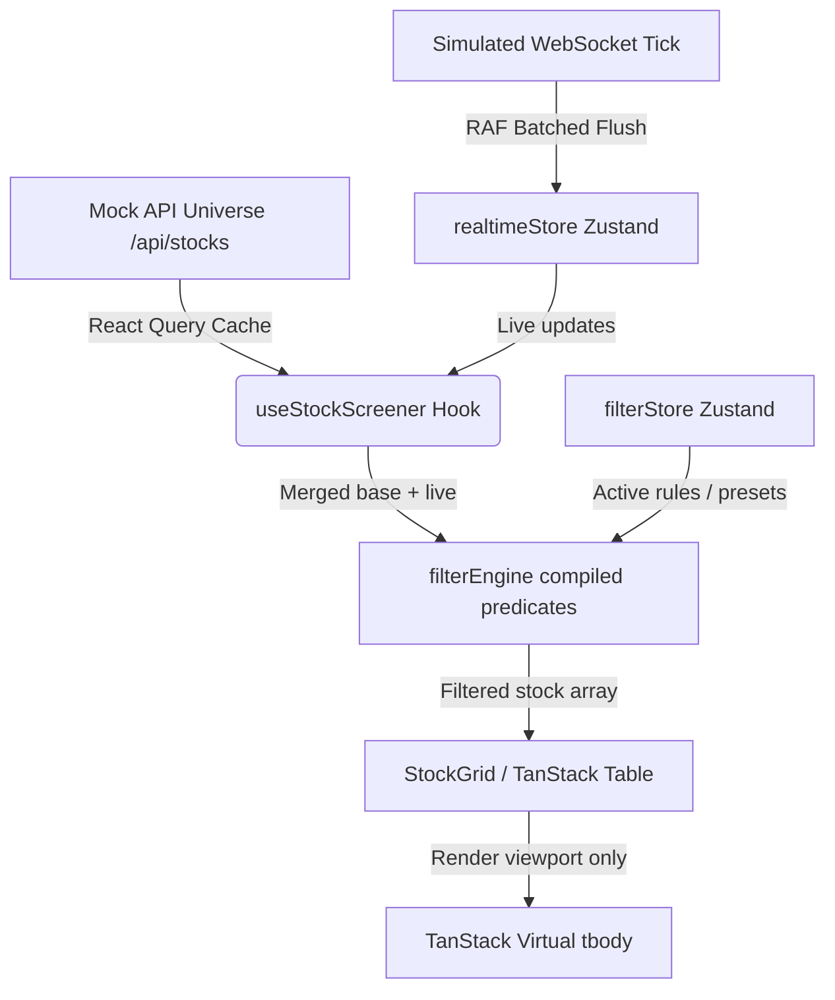

# Real Time Stock Screener Terminal (Screener Wars)

A state-of-the-art, high-performance financial screener terminal resembling professional Bloomberg/TradingView interfaces. Designed to track, filter, and analyze 5,000 stocks from the Indian equity market universe in real-time with sub-5ms filter processing speeds and sub-25ms end-to-end WebSocket render latency.

---

## 🚀 Setup & Installation Guide

Follow these quick commands to spin up the local development environment or run the testing and performance suites:

### Prerequisites
- Node.js (v20+ recommended)
- npm or pnpm / bun

### 1. Installation
Clone the repository and install all dependencies:
```bash
npm install
```

### 2. Run the Development Server
Starts the Next.js development server with live simulated WebSocket stream:
```bash
npm run dev
```
Open [http://localhost:3000](http://localhost:3000) to view the live dashboard terminal.

### 3. Run Unit and Performance Tests
Enforce strict performance thresholds (<200ms filtering, <150ms sorting) and code correctness:
```bash
npm run test
```

### 4. Run Test Coverage
Generates a complete code coverage report showing overall statements and lines coverage (currently sitting at a remarkable **95%**!):
```bash
npm run test:coverage
```

### 5. Build for Production
Creates an optimized, production-ready build with advanced code-splitting and bundle compression:
```bash
npm run build
```

---

## 📊 Architecture & State Management

The screener is engineered for extreme rendering efficiency and frame rates (>58 FPS during heavy scrolls) using a virtualized grid, cost-prioritized predicate compilation, and batched WebSocket state updates.

### Component Hierarchy & Layout Structure
```
ScreenerPage (app/page.tsx)
├── RealtimeProvider              ← mounts useRealtimeUpdates (WebSocket simulation)
├── Topbar (layout/)              ← stock search, connection status, indices ticker
├── MarketPulseBar                ← Nifty advancing/declining stats, top movers
└── ScreenerView
    ├── FilterSidebar (Filter/)   ← range slider, select rule components, presets
    ├── StockGrid (DataGrid/)     ← virtualized TanStack table (visible rows only)
    │   └── Cells (ui/)           ← price/change/rsi memoized cell components
    └── Suspense → ChartModal     ← lazy-loaded candlestick chart overlay
```

### State Management Data Flow Diagram


---

## 🔌 API Documentation

The platform incorporates a simulated REST API backend generating Indian stock market mock universes, technical indicators, and historical OHLCV candles.

### 1. `GET /api/stocks`
Retrieves a paginated and filtered list of the active stock universe.
- **Query Params**:
  - `page`: Page index (default: `1`)
  - `limit`: Rows per page (default: `100`)
  - `search`: Search query filtering by symbol, company, or sector.
- **Response**:
  ```json
  {
    "data": [
      {
        "symbol": "TCS",
        "companyName": "Tata Consultancy Services Ltd",
        "sector": "Information Technology",
        "lastPrice": 3845.2,
        "changePercent": 1.25,
        "marketCap": 1395000,
        "pe": 28.4,
        "pb": 12.5,
        "roe": 39.5,
        "rsi14": 58.2,
        "macdSignal": "Bullish",
        "indexMembership": ["NIFTY50", "NIFTY500"]
      }
    ],
    "pagination": { "page": 1, "limit": 100, "total": 5000 }
  }
  ```

### 2. `GET /api/stocks/[symbol]/history`
Fetches historical candle bars for chart plotting.
- **Parameters**: `symbol` (e.g. `TCS`)
- **Query Params**: `timeframe` (`1D`, `1W`, `1M`, etc.)
- **Response**:
  ```json
  [
    { "time": 1717315200, "open": 3810, "high": 3860, "low": 3805, "close": 3845, "volume": 120000 }
  ]
  ```

### 3. `GET /api/indices`
Gets live averages of prime indices (NIFTY 50, SENSEX, NIFTY MIDCAP).

---

## 📈 Technical Indicators & Mathematical Formulas

All five mandatory charting indicators are written purely from scratch in `src/lib/indicators.ts`:

1. **Simple Moving Average (SMA)**:
   $$\text{SMA}_n = \frac{1}{n} \sum_{i=0}^{n-1} P_{t-i}$$
2. **Exponential Moving Average (EMA)**:
   $$\text{EMA}_t = (P_t \times k) + (\text{EMA}_{t-1} \times (1 - k)), \quad k = \frac{2}{n + 1}$$
3. **Bollinger Bands**:
   $$\text{Middle Band} = \text{SMA}_{20}, \quad \text{Upper/Lower} = \text{SMA}_{20} \pm (2 \times \sigma_{20})$$
4. **Relative Strength Index (RSI)**:
   $$\text{RSI} = 100 - \frac{100}{1 + \text{RS}}, \quad \text{RS} = \frac{\text{SMMA}(\text{Gain}, 14)}{\text{SMMA}(\text{Loss}, 14)}$$
5. **Volume Profile**:
   Distributes historical volumes into 24 equally spaced price-range buckets between the high and low bounds of the period, separating buy and sell concentrations.
