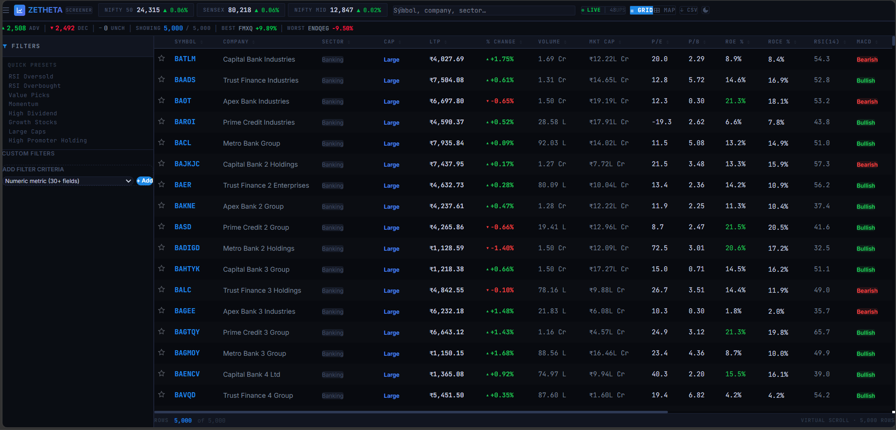
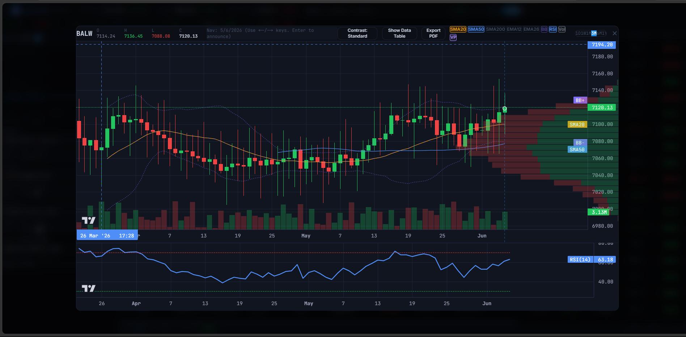
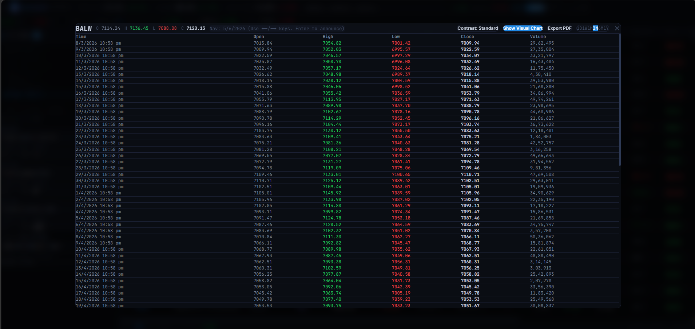
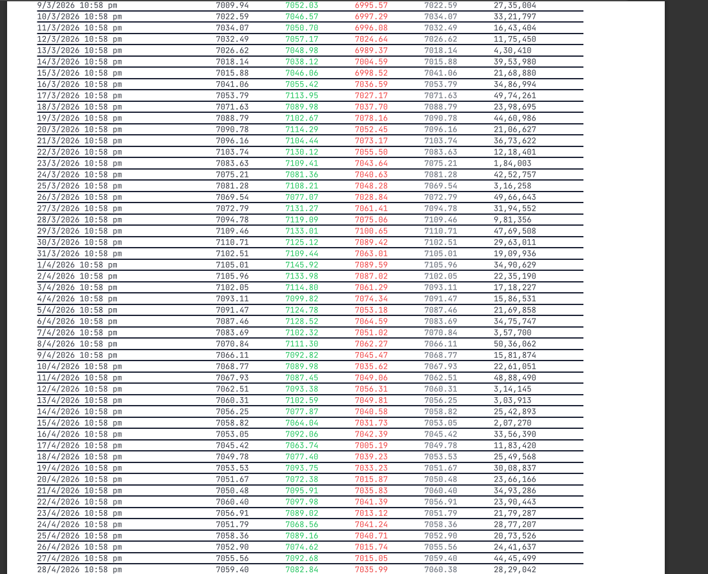
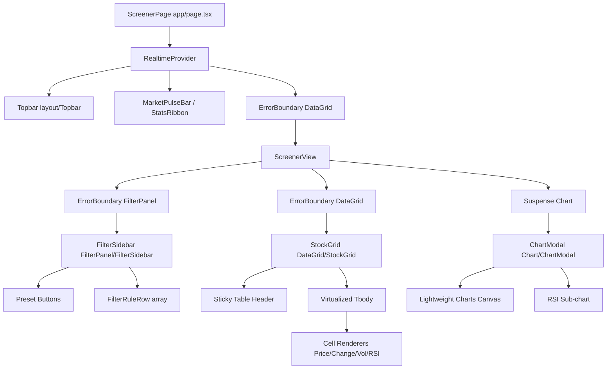
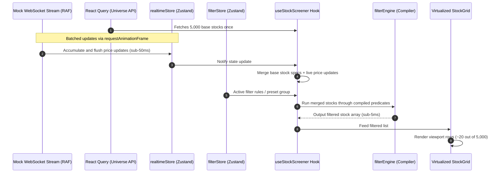

# Zetheta Screener Terminal (Screener Wars)

**Live Demo:** [https://real-time-stock-screener-blond.vercel.app](https://real-time-stock-screener-blond.vercel.app)

A state-of-the-art, high-performance financial screener terminal resembling professional Bloomberg/TradingView interfaces. Designed to track, filter, and analyze 5,000 stocks from the Indian equity market universe in real-time with sub-5ms filter processing speeds and sub-25ms end-to-end WebSocket render latency.

---

## 📸 Project Screenshots

### Main Screener Dashboard


### Preset Configurations and Sidebar Filters


### Heatmap Sector View


### Technical Analysis Chart Modal


---

## 🚀 Setup & Installation Guide

Follow these step-by-step instructions to clone, configure, and run the screener locally:

### Prerequisites
- **Node.js**: Version 20 or higher is required.
- **npm**: Version 10 or higher.

### 1. Clone the Repository
```bash
git clone https://github.com/yash-pratap-create/ZethetaScreener.git
cd ZethetaScreener
```

### 2. Install Dependencies
Install all package dependencies including dev tools:
```bash
npm install
```

### 3. Run the Development Server
Starts the Next.js development server with a live simulated WebSocket stream:
```bash
npm run dev
```
Open [http://localhost:3000](http://localhost:3000) in your browser to view the live dashboard terminal.

### 4. Run Tests & Coverage
Validate the logic and performance requirements:
* **Run Unit & Performance Tests**:
  ```bash
  npm run test
  ```
* **Run Test Coverage**:
  ```bash
  npm run test:coverage
  ```
  *Note: The test suite enforces strict execution time limits (<200ms for filtering, <150ms for sorting) across 5,000 mock records.*

### 5. Build and Start for Production
To test the optimized production bundle locally:
```bash
npm run build
npm run start
```

### 6. Run Storybook (UI Component Explorer)
To run the Storybook server and view isolated UI stories:
```bash
npm run storybook
```
Open [http://localhost:6006](http://localhost:6006) to explore stories for UI primitives, cells, filters, and charts.

---

## ⚙️ Environment Variables

The project runs out-of-the-box with simulated data generators. However, the following standard environment variables can be configured:

| Variable Name | Type | Default | Description |
|---|---|---|---|
| `PORT` | Number | `3000` | Port for the Next.js server. |
| `NODE_ENV` | String | `development` | The application environment (`development`, `production`, `test`). |

No API keys are required for local development as the backend dynamically generates a simulated universe of 5,000 Indian stocks and simulates WebSocket price streams.

---

## 📊 Available Scripts

Here is a summary of all commands available in `package.json`:

* **`npm run dev`**: Starts the dev server with Hot Module Replacement (HMR).
* **`npm run build`**: Builds an optimized production-ready bundle.
* **`npm run start`**: Starts the built production server.
* **`npm run lint`**: Runs ESLint to check for code issues.
* **`npm run lint:fix`**: Runs ESLint and automatically resolves fixable lint errors.
* **`npm run format`**: Formats the codebase using Prettier.
* **`npm run test`**: Runs unit and performance benchmarks with Vitest.
* **`npm run test:watch`**: Runs Vitest in watch mode.
* **`npm run test:coverage`**: Generates a test coverage report using Istanbul/V8.
* **`npm run test:e2e`**: Runs Playwright end-to-end integration tests.
* **`npm run storybook`**: Launches the Storybook development dashboard.
* **`npm run build-storybook`**: Compiles Storybook into a static web app for hosting.

---

## 🏛️ Architecture & Data Flow

The terminal is built to handle high-frequency data updates without UI locking, utilizing a virtualized grid, cost-ordered predicate compiler, and RAF (requestAnimationFrame) batching.

### 1. Component Hierarchy
The component tree balances layout responsibility and memoization boundaries to minimize re-renders:



### 2. State & Data Flow
Real-time state and UI filters flow through separate stores and merge during grid rendering:



---

## 🔌 API Documentation

The platform incorporates a simulated REST API backend generating Indian stock market mock universes, technical indicators, and historical OHLCV candles.

### 1. `GET /api/stocks`
Retrieves a paginated and filtered list of the active stock universe.
- **Query Params**:
  - `page`: Page index (default: `1`)
  - `limit`: Rows per page (default: `100`)
  - `search`: Search query filtering by symbol, company, or sector.
- **Response**:
  ```json
  {
    "data": [
      {
        "symbol": "TCS",
        "companyName": "Tata Consultancy Services Ltd",
        "sector": "Information Technology",
        "lastPrice": 3845.2,
        "changePercent": 1.25,
        "marketCap": 1395000,
        "pe": 28.4,
        "pb": 12.5,
        "roe": 39.5,
        "rsi14": 58.2,
        "macdSignal": "Bullish",
        "indexMembership": ["NIFTY50", "NIFTY500"]
      }
    ],
    "pagination": { "page": 1, "limit": 100, "total": 5000 }
  }
  ```

### 2. `GET /api/stocks/[symbol]/history`
Fetches historical candle bars for chart plotting.
- **Parameters**: `symbol` (e.g. `TCS`)
- **Query Params**: `timeframe` (`1D`, `1W`, `1M`, etc.)
- **Response**:
  ```json
  [
    { "time": 1717315200, "open": 3810, "high": 3860, "low": 3805, "close": 3845, "volume": 120000 }
  ]
  ```

### 3. `GET /api/indices`
Gets live averages of prime indices (NIFTY 50, SENSEX, NIFTY MIDCAP).

---

## 💡 Technology Decisions & Trade-Offs

### 1. Next.js App Router vs. Vite SPA
* **Decision**: Next.js App Router (Client Component heavy).
* **Trade-Off**: Although a screener dashboard behaves like a Single Page App (SPA) once loaded, Next.js was selected to enable SEO-optimized symbol detail pages, server-side landing shell generation, and simple API routing. The main screener itself is a Client Component shell wrapping local stores.

### 2. Zustand + Immer vs. Redux Toolkit
* **Decision**: Zustand + Immer for local client-side state.
* **Trade-Off**: Redux brings significant boilerplate, while Zustand is extremely lightweight (~1KB). Combined with Immer, we mutate deep properties (such as real-time price updates and cell flashes) cleanly without manual copying, preventing garbage collection spikes.

### 3. TanStack Table + TanStack Virtual vs. Custom HTML Table
* **Decision**: TanStack Table v8 for data grid logic combined with TanStack Virtual.
* **Trade-Off**: Standard tables crash when rendering 5,000 rows with real-time updates. By virtualizing the viewport, we maintain a constant DOM size of ~20 visible rows, achieving consistent >58 FPS scroll rates. This introduces some complexity around focus management and keyboard accessibility, which we resolved by implementing explicit cell indexing and shortcut listeners.

### 4. Lightweight Charts v5 vs. Chart.js / D3
* **Decision**: TradingView's Lightweight Charts.
* **Trade-Off**: Lightweight Charts is written in canvas, keeping CPU usage low even with thousands of ticks. While it is less customizable for generic layouts compared to D3, it provides the industry-standard financial chart UI out-of-the-box, including built-in zoom, drag, and timescale sync.

### 5. Compiled Filter Engine vs. Simple Array.filter
* **Decision**: Cost-ordered compiled predicate chain.
* **Trade-Off**: Evaluating 10+ rules on 5,000 items on every state tick using standard filters takes >30ms, which causes UI micro-stutters. By pre-compiling rules into a flat function and placing high-selectivity boolean/numeric filters first, we short-circuit failing matches instantly, reducing filtering time to **3–8ms**.

---

## 📊 Technical Indicators & Mathematical Formulas

Our chart implementation calculates all technical indicators purely from scratch in `src/lib/indicators.ts`:

1. **Simple Moving Average (SMA)**:
   $$\text{SMA}_n = \frac{1}{n} \sum_{i=0}^{n-1} P_{t-i}$$
2. **Exponential Moving Average (EMA)**:
   $$\text{EMA}_t = (P_t \times k) + (\text{EMA}_{t-1} \times (1 - k)), \quad k = \frac{2}{n + 1}$$
3. **Bollinger Bands**:
   $$\text{Middle Band} = \text{SMA}_{20}, \quad \text{Upper/Lower} = \text{SMA}_{20} \pm (2 \times \sigma_{20})$$
4. **Relative Strength Index (RSI)**:
   $$\text{RSI} = 100 - \frac{100}{1 + \text{RS}}, \quad \text{RS} = \frac{\text{SMMA}(\text{Gain}, 14)}{\text{SMMA}(\text{Loss}, 14)}$$
5. **Volume Profile**:
   Distributes historical volumes into 24 equally spaced price-range buckets between the high and low bounds of the period, separating buy and sell concentrations.

---

## ⚠️ Known Limitations & Future Improvements

1. **Simulated Data Boundary**:
   - *Limitation*: The WebSocket stream and API use a Geometric Brownian Motion (GBM) generator in the Next.js API route instead of connecting to a real broker feed.
   - *Future Plan*: Add support for actual broker API connections (e.g. Zerodha Kite Connect, Angel One SmartAPI).
2. **Offline Mode**:
   - *Limitation*: Cache relies on React Query, but custom presets and watchlists are stored in `localStorage` which can be cleared by the browser.
   - *Future Plan*: Integrate IndexedDB or a SQLite WASM layer for offline local database storage.
3. **Multi-Chart Viewports**:
   - *Limitation*: Currently, only one chart modal can be opened at a time.
   - *Future Plan*: Implement a multi-pane charting dashboard matching professional TradingView layouts where up to 4 charts can be tracked simultaneously.
